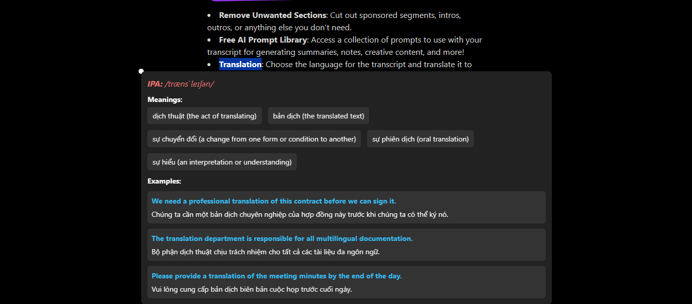
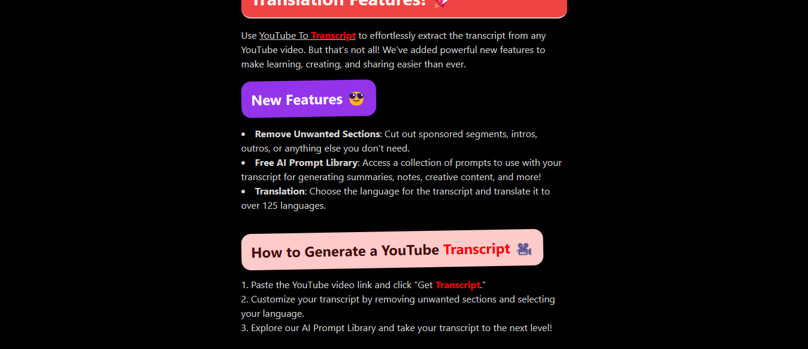

# 📚 Vocab Extension – Tiện ích mở rộng hỗ trợ học từ vựng

---
## ✨ Giới thiệu

Trong quá trình đọc tài liệu tiếng Anh, tôi thường gặp khó khăn khi sử dụng các tiện ích tra từ: thông tin hiển thị thường chỉ gồm nghĩa và phát âm, và việc lưu lại từ để học sau này mất khá nhiều thời gian, thao tác không thuận tiện.

Từ nhu cầu cá nhân đó, tôi đã phát triển tiện ích này với các mục tiêu:
- Hỗ trợ tra cứu từ nhanh chóng, chi tiết và trực quan hơn
- Dễ dàng lưu lại từ đã tra để phục vụ việc ôn tập (trang web ôn tập từ vựng đang được phát triển)
- Hiển thị từ đã học lại trong ngữ cảnh thực tế (highlight từ trên trang web)

---

## ⚙️ Tính năng chính

### Chrome Extension
- Bôi đen từ để:
  - Tra cứu thông tin từ vựng (IPA, 5 nghĩa, 3 câu ví dụ sử dụng từ đó)
- Nhấn `Ctrl + Q` để:
  - Highlight từ trên toàn bộ trang web
  - Gửi dữ liệu đến server để lưu trữ
- Tự động lưu từ đã tra vào **Session Storage** để tránh gọi lại API
- Tích hợp **Gemini API** để lấy thông tin phong phú từ AI
- **Nút "Reset"** trên giao diện popup: 
  - Dễ dàng xóa cache từ vựng nếu gặp lỗi hoặc cần làm mới

### Backend (Node.js + Express)
- Quản lý các từ vựng đã tra cứu
- Cung cấp các API phục vụ lưu trữ và truy xuất
- Cấu trúc rõ ràng: routes, controllers, services, models
- Database: MySql
---


---

## 🛠 Công nghệ sử dụng

- Chrome Extension (JavaScript , phiên bản manifest_version 3) 
- Gemini API
- Session Storage
- Node.js, Express
- MySql

## 🚀 Hướng dẫn sử dụng

### ⚙️ Khởi chạy backend
```bash
cd server_aistudio
npm install
npm run dev

### 🖥 Cài đặt extension lên trình duyệt Chrome
1. Mở trình duyệt và truy cập: `chrome://extensions/`
2. Bật **Developer mode** (Chế độ nhà phát triển)
3. Nhấn nút **Load unpacked** (Tải tiện ích chưa nén)
4. Chọn thư mục `extension/` trong dự án
5. Hoàn tất: Tiện ích sẽ hiển thị trên thanh công cụ

> ✅ Sau khi cài, bạn có thể bôi đen từ và nhấn `Ctrl + Q` để tra cứu + highlight.
```
<p align="center">
    
  <br>
  <em>Bôi đen để thực hiện tra cứu và lưu vào Session Storage</em>
    <br></br>
</p>

<p align="center">
      
  <br>
  <em>Nhấn Ctrl + Q để hightlight và lưu vào Database</em>
    <br></br>
</p>